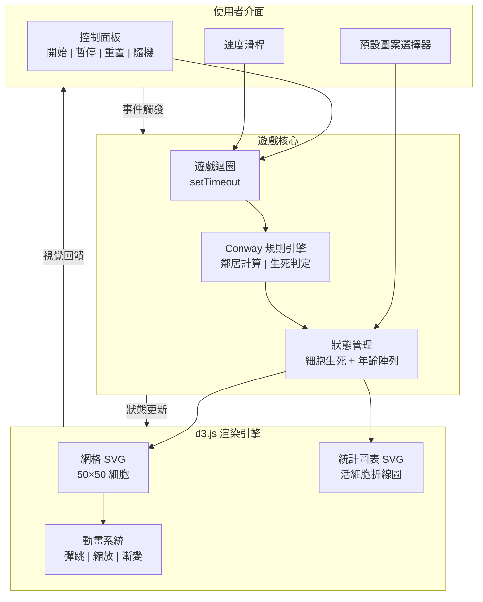
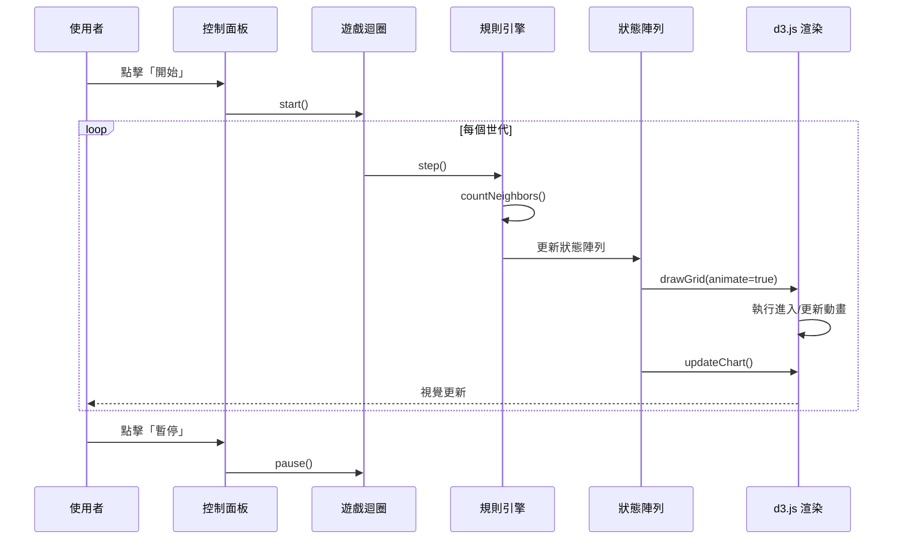
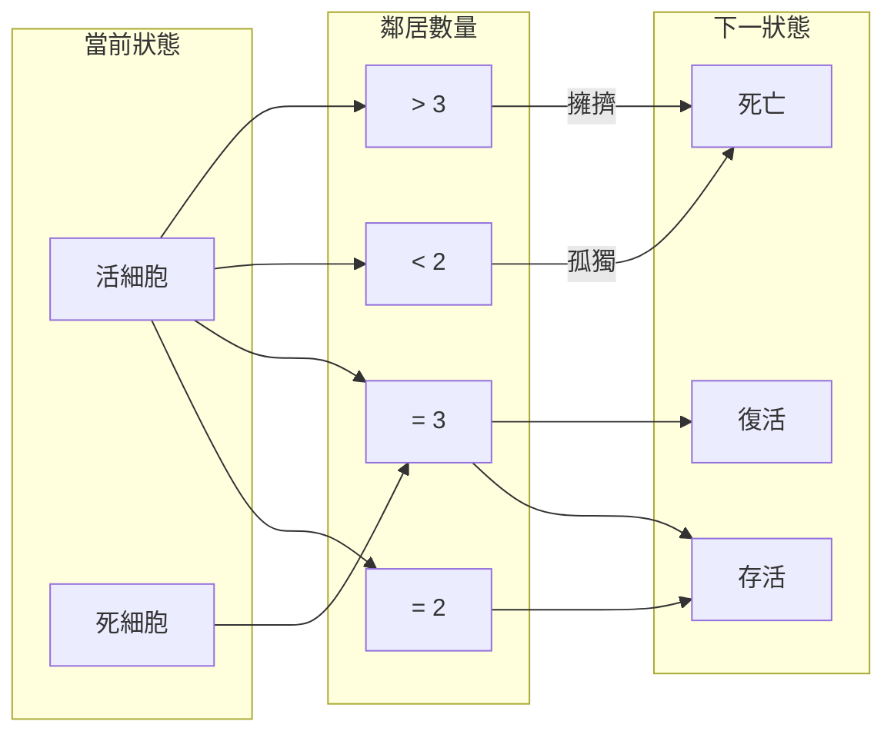

# Conway's Game of Life

[](https://opensource.org/licenses/MIT)
[](https://d3js.org/)
[](https://tailwindcss.com/)

[← 回到 Muripo HQ](https://tznthou.github.io/muripo-hq/)

網頁版 Conway 生命遊戲模擬器，使用 **d3.js** 進行 SVG 渲染與資料驅動更新，搭配 **Tailwind CSS** 打造現代化介面。

> 了解更多：[康威生命遊戲 - 維基百科](https://zh.wikipedia.org/wiki/康威生命游戏)

---

## 功能特色

- **50 × 50 網格**：點擊細胞切換生死狀態
- **模擬控制**：開始、暫停、重置、隨機初始化
- **速度調整**：50ms ~ 1000ms（1~20 代/秒）
- **世代計數**：即時顯示當前世代數
- **預設圖案**：6 種經典圖案一鍵載入
- **即時統計圖表**：顯示活細胞數量變化的折線圖（d3.js 經典應用）
- **細胞年齡視覺化**：根據存活世代數自動變色
  - 新生（1-2 代）：翠綠色
  - 年輕（3-9 代）：青藍色
  - 成熟（10-29 代）：靛藍色
  - 穩定（30+ 代）：紫色
- **d3.js 動畫**：
  - 新生細胞彈跳放大效果
  - 死亡細胞縮小淡出效果
  - 顏色平滑漸變（d3.interpolateRgb）
  - 折線圖平滑過渡
  - hover 放大互動

---

## 系統架構



### 資料流程



---

## 技術棧

| 技術 | 版本 | 用途 |
|------|------|------|
| HTML5 | - | 頁面結構 |
| Tailwind CSS | 3.x (CDN) | UI 樣式 |
| d3.js | v7 | SVG 渲染、資料綁定、過渡動畫 |
| JavaScript | ES6+ | 遊戲邏輯 |

---

## 快速開始

### 方法一：直接開啟

```bash
# 複製專案
git clone https://github.com/your-username/day-08-game-of-life.git

# 直接用瀏覽器開啟
open index.html
```

### 方法二：使用 Live Server

```bash
# 安裝 live-server（如果還沒有）
npm install -g live-server

# 啟動開發伺服器
live-server
```

### 使用方式

1. 點擊細胞繪製初始狀態，或選擇預設圖案
2. 點擊「開始」觀看演化
3. 調整速度滑桿改變演化速度
4. 觀察統計圖表追蹤活細胞數量變化

---

## 遊戲規則

Conway 生命遊戲遵循以下規則：



| 規則 | 條件 | 結果 |
|------|------|------|
| 存活 | 活細胞 + 2~3 個活鄰居 | 繼續存活 |
| 孤獨死 | 活細胞 + < 2 個活鄰居 | 死亡 |
| 擁擠死 | 活細胞 + > 3 個活鄰居 | 死亡 |
| 繁殖 | 死細胞 + 恰好 3 個活鄰居 | 復活 |

> 邊界視為死亡（非環面）。

---

## 預設圖案

| 圖案 | 類型 | 說明 |
|------|------|------|
| Glider | 太空船 | 斜向移動的經典圖案 |
| LWSS | 太空船 | 水平移動的輕量太空船 |
| Blinker | 振盪器 | 週期 2 的簡單振盪 |
| Beacon | 振盪器 | 週期 2 的閃爍效果 |
| Pulsar | 振盪器 | 週期 3 的壯觀對稱圖案 |
| Gosper Gun | 槍 | 每 30 代發射一個滑翔機 |

---

## 專案結構

```
day-08-game-of-life/
├── index.html    # HTML 結構與 UI 元件
├── style.css     # 自訂樣式（細胞網格、圖表）
├── app.js        # 遊戲邏輯、d3.js 渲染、事件處理
├── LICENSE       # MIT 授權條款
└── README.md     # 專案說明
```

---

## 隨想

### Conway 的矛盾

有趣的是，John Conway 本人對生命遊戲的名氣感到矛盾。這個用午餐時間隨手設計的小遊戲，意外成為他最廣為人知的作品，卻也掩蓋了他在群論、紐結理論、超現實數等領域更深刻的數學貢獻。他曾表示對於不斷被問及生命遊戲感到厭煩。

然而，正如羅蘭·巴特所言：「作者已死」作品一旦誕生，其意義便不再由創作者獨佔。

### 社會性的隱喻？

觀察生命遊戲的規則，不禁讓人聯想：

| 規則 | 隱喻 |
|------|------|
| 鄰居 < 2 → 死亡 | 孤獨使人凋零 |
| 鄰居 2-3 → 存活 | 適度連結維持生命 |
| 鄰居 > 3 → 死亡 | 過度擁擠令人窒息 |
| 鄰居 = 3 → 新生 | 社群孕育新生命 |

這是否暗示「人無法獨居」？

當然，這樣的解讀可能是一種**我自己的過度解讀**我們傾向在符合既有信念的地方看見意義。Conway 選擇這組規則，是因為它在數學上能產生最豐富的動態行為，而非刻意模擬人類社會。

但也許，生命遊戲之所以讓人覺得「有趣」，正是因為它無意間觸及了某種更普遍的原則**穩定的複雜系統需要適度的連結密度**。

無論如何，能從 4 條簡單規則中引發這樣的思辨，或許正是生命遊戲超越創作者意圖、持續啟發人心的原因，至少他引起了我無限的遐想，所以開發了這個專案？

---

## 致敬

本專案向以下先驅致敬：

- **[John Horton Conway](https://zh.wikipedia.org/wiki/約翰·何頓·康威)**（1937-2020）— 英國數學家，1970 年發明生命遊戲，開創細胞自動機研究領域
- **[Martin Gardner](https://zh.wikipedia.org/wiki/馬丁·乔登·葛乐尔)**（1914-2010）— 美國科普作家，1970 年在《Scientific American》專欄推廣生命遊戲，使其廣為人知

---

## 授權

本專案採用 [MIT License](LICENSE) 授權。
