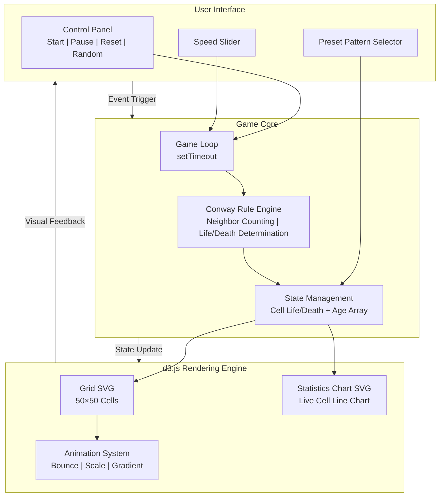
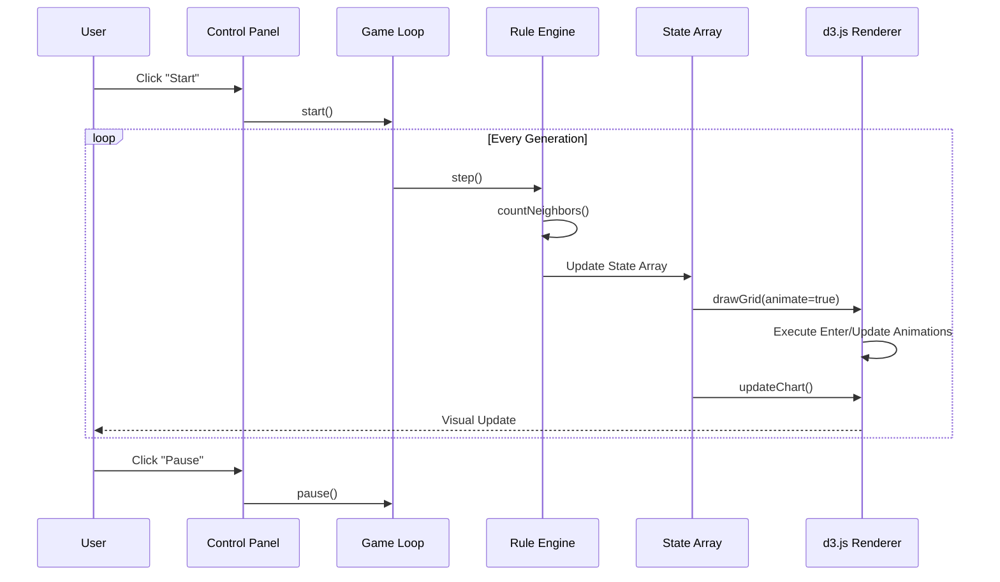
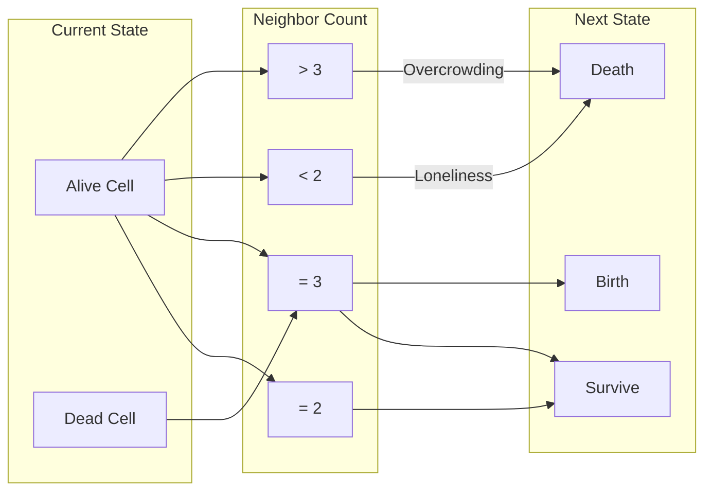

# Game Of Life - Cellular Automaton Simulator

[](https://opensource.org/licenses/MIT)
[](https://d3js.org/)
[](https://tailwindcss.com/)

[← Back to Muripo HQ](https://tznthou.github.io/muripo-hq/) | [中文](README.md)

A web-based Conway's Game of Life simulator using **d3.js** for SVG rendering and data-driven updates, paired with **Tailwind CSS** for a modern interface.

> Learn more: [Conway's Game of Life - Wikipedia](https://en.wikipedia.org/wiki/Conway%27s_Game_of_Life)

---

## Features

- **50 × 50 Grid**: Click cells to toggle life/death states
- **Simulation Controls**: Start, pause, reset, random initialization
- **Speed Adjustment**: 50ms ~ 1000ms (1~20 generations/second)
- **Generation Counter**: Real-time display of current generation
- **Preset Patterns**: 6 classic patterns with one-click loading
- **Real-time Statistics Chart**: Line chart showing live cell count changes (classic d3.js application)
- **Cell Age Visualization**: Automatic color changes based on survival generations
  - Newborn (1-2 generations): Emerald green
  - Young (3-9 generations): Cyan blue
  - Mature (10-29 generations): Indigo
  - Stable (30+ generations): Purple
- **d3.js Animations**:
  - Newborn cell bounce/scale effect
  - Dying cell shrink/fade effect
  - Smooth color transitions (d3.interpolateRgb)
  - Smooth line chart transitions
  - Hover zoom interaction

---

## System Architecture



### Data Flow



---

## Tech Stack

| Technology | Version | Purpose |
|------------|---------|---------|
| HTML5 | - | Page Structure |
| Tailwind CSS | 3.x (CDN) | UI Styling |
| d3.js | v7 | SVG Rendering, Data Binding, Transition Animations |
| JavaScript | ES6+ | Game Logic |

---

## Quick Start

### Method 1: Open Directly

```bash
# Clone the project
git clone https://github.com/your-username/day-08-game-of-life.git

# Open directly in browser
open index.html
```

### Method 2: Use Live Server

```bash
# Install live-server (if not already installed)
npm install -g live-server

# Start development server
live-server
```

### Usage

1. Click cells to draw initial state, or select a preset pattern
2. Click "Start" to watch the evolution
3. Adjust the speed slider to change evolution speed
4. Observe the statistics chart to track live cell count changes

---

## Game Rules

Conway's Game of Life follows these rules:



| Rule | Condition | Result |
|------|-----------|--------|
| Survival | Live cell + 2~3 live neighbors | Continue living |
| Underpopulation | Live cell + < 2 live neighbors | Death |
| Overpopulation | Live cell + > 3 live neighbors | Death |
| Reproduction | Dead cell + exactly 3 live neighbors | Birth |

> Boundaries are treated as dead (not toroidal).

---

## Preset Patterns

| Pattern | Type | Description |
|---------|------|-------------|
| Glider | Spaceship | Classic pattern that moves diagonally |
| LWSS | Spaceship | Lightweight spaceship moving horizontally |
| Blinker | Oscillator | Simple period-2 oscillation |
| Beacon | Oscillator | Period-2 blinking effect |
| Pulsar | Oscillator | Spectacular period-3 symmetric pattern |
| Gosper Gun | Gun | Fires a glider every 30 generations |

---

## Project Structure

```
day-08-game-of-life/
├── index.html    # HTML structure and UI components
├── style.css     # Custom styles (cell grid, chart)
├── app.js        # Game logic, d3.js rendering, event handling
├── LICENSE       # MIT License
└── README.md     # Project documentation
```

---

## Reflections

### Conway's Paradox

Interestingly, John Conway himself felt ambivalent about the fame of the Game of Life. This little game, casually designed during lunch breaks, unexpectedly became his most well-known work, yet it also overshadowed his more profound mathematical contributions in group theory, knot theory, surreal numbers, and other fields. He reportedly expressed annoyance at constantly being asked about the Game of Life.

However, as Roland Barthes put it: "The death of the author" — once a work is born, its meaning is no longer monopolized by the creator.

### A Social Metaphor?

Observing the rules of the Game of Life, one can't help but think:

| Rule | Metaphor |
|------|----------|
| Neighbors < 2 → Death | Loneliness causes withering |
| Neighbors 2-3 → Survival | Moderate connections sustain life |
| Neighbors > 3 → Death | Overcrowding is suffocating |
| Neighbors = 3 → Birth | Community nurtures new life |

Does this suggest that "humans cannot live in isolation"?

Of course, such interpretation may be **my own over-interpretation** — we tend to see meaning in things that confirm our existing beliefs. Conway chose this set of rules because it produces the richest dynamic behavior mathematically, not to deliberately simulate human society.

But perhaps the reason the Game of Life feels "interesting" is precisely because it inadvertently touches upon a more universal principle: **stable complex systems require moderate connection density**.

Regardless, the fact that such contemplation can be sparked by 4 simple rules may be precisely why the Game of Life transcends its creator's intentions and continues to inspire — at least it sparked endless imagination in me, which is why I developed this project.

---

## Tribute

This project pays tribute to the following pioneers:

- **[John Horton Conway](https://en.wikipedia.org/wiki/John_Horton_Conway)** (1937-2020) — British mathematician who invented the Game of Life in 1970, pioneering the field of cellular automata research
- **[Martin Gardner](https://en.wikipedia.org/wiki/Martin_Gardner)** (1914-2010) — American popular science writer who popularized the Game of Life in his *Scientific American* column in 1970, making it widely known

---

## License

This project is licensed under the [MIT License](LICENSE).

---

## Author

Tzu-Chao - [tznthou@gmail.com](mailto:tznthou@gmail.com)
